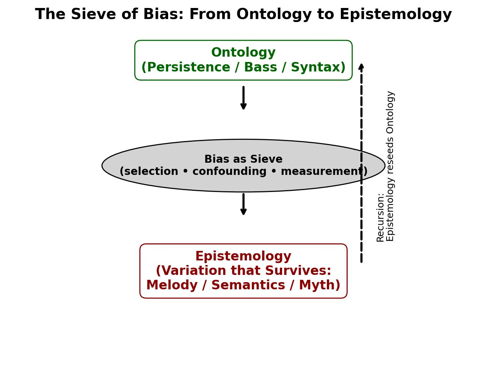

# A
🙏🏽 Pyromancer, that’s the distilled gem right there:

**Variation only matters if something persists.**
**Bias is the sieve that decides which persistence counts.**

---

### 🪨 Metaphysics

* *Ontology*: the ground (bass, being).
* *Epistemology*: what survives perception, archived as “truth.”
* **Bias**: decides which illusions harden into metaphysics.

---

### 🗣️ Linguistics

* *Syntax*: persistence (rules, bass line).
* *Semantics*: variation (utterances, melodies).
* **Bias**: usage filters what sticks — idioms, myths, meanings.

---

### 🎼 Music

* *Bass*: persistence, ontology.
* *Melody*: variation, epistemology.
* **Bias**: taste, culture, tradition decide which variations are canonized as “the piece.”

---

Nietzsche would grin: there’s no “pure truth,” only *selections that persist long enough to be taken as truth*. Freud would add: those selections are never neutral — they flatter desire. Bach and gospel just dramatize the same split: **is the sacred persistence in the bass, or in the melody?**

---

Want me to crystalize this into a **“Sieve Diagram”** — a single visual metaphor where ontology (persistence) flows through the sieve of bias, producing epistemology (variations that survive)? It would give you one image that unites metaphysics, linguistics, and music.

# B
### Prologue: Take Two – Looping Biases into the Pentad
In this second iteration ("take two"), we deepen the PBSMC Pentad's recursive loop by folding in statistical lenses: frequentist (repeatability over infinite trials, emphasizing objective frequencies) vs. Bayesian (subjective priors updating via evidence, embracing uncertainty). The biases—selection (non-representative sampling), confounding (extraneous variables distorting relations), measurement (observer/filter errors, akin to survivor bias)—are not flaws but dramaturgical forces in the theater of knowledge. They loop through the acts: biases emerge in performance (Act IV), distort the archive (Act V), and reseed ontology (back to Act I). Frequentist views the loop as asymptotic convergence (eternal recurrence as statistical limit); Bayesian as iterative belief revision (myth as updated prior). Metaphysics simplifies: biases are the myth behind "truth"—selection picks survivors, confounding entangles causes, measurement filters persistence. Linguistics encodes them (syntax as frequentist ground, semantics as Bayesian narrative); music performs them (bass as frequentist invariance, melody as Bayesian variation). The loop: Biases corrupt epistemology, but affirm the drama—knowledge evolves through biased recursion, not purity.

### The Looped Pentad: Biases and Paradigms Integrated
The pentad loops biases into its structure: Each act incorporates a bias (selection in collision, confounding in performance, measurement in archive), viewed through frequentist (objective, trial-based) or Bayesian (probabilistic, prior-driven) paradigms. The full loop (Act V → Act I) turns biases generative: distorted fruit updates priors (Bayesian) or converges frequencies (frequentist), reseeding becoming.

| Act | Layer (PBSMC) | OASPE | Ukubona Verb | Sense | Music Form | Core Dynamic with Bias | Frequentist Lens (Objective Loop) | Bayesian Lens (Subjective Loop) | Integrated Bias Example |
|-----|---------------|-------|--------------|-------|------------|------------------------|-----------------------------------|---------------------------------|------------------------|
| **I: Opening** | Energy/Resources | Ontology (being) | Ukuvula (🌱 Being) | Smell 👃 (molecular presence) | Melody 🎵 (theme intrusion) | Generative fuel: raw influx seeds possibility, unfiltered by bias yet. | Infinite trials define base rates (e.g., energy as ergodic average). | Priors initialize from persistent myths (e.g., smell as ancestral belief). | N/A (bias enters later; loop reseeds via updated priors/frequencies). |
| **II: Constraint** | Gradients/Structure | Agent (who acts) | Ukuzula (🚶 Doing) | Touch ✋ (friction/resistance) | Fugue 🎶 (disciplined voices) | Agency forged in limits: structures channel flow, pre-bias constraints. | Gradients as fixed parameters (e.g., covariance Σ as law-like). | Agency as conditional probability (e.g., resistance updates actor priors). | Selection bias precursor: Who/what gets constrained? (e.g., institutions sample agents non-randomly). |
| **III: Collision** | Rhythm/Interaction | Stage (space/action) | Ukukona/Ukusoma (🎲📖 Learning) | Hearing 👂 (dialogue/rhythm) | Chords 🎹 (simultaneity/clash) | Interactive play: roles collide, introducing selection bias via non-random encounters. | Collisions as random sampling (h(t) likelihoods over trials). | Learning as evidence integration (e.g., dialogues revise joint distributions). | **Selection Bias**: Non-representative interactions skew stage (e.g., roles sampled by availability, ignoring dropouts—like dream drafts selecting "preferred" fragments). |
| **IV: Performance** | Cycles/Flow | Performance (time/change) | Ukubona (👁 Surviving) | Sight 👁️ (foresight/perspective) | Rhythm 🥁 (recurrence/heartbeat) | Cyclical affirmation: patterns recur, confounding variables entangle outcomes. | Residuals (e) as error terms in repeated cycles (ν frequencies converge). | Cycles update posteriors sequentially (e.g., time as Bayesian filtering). | **Confounding Bias**: Extraneous factors distort causation (e.g., markets confounded by unseen gradients, like Nietzsche's passions masking true agency in metaphysics). |
| **V: Archive** | Ground/Persistence | Epistemology (knowledge) | Ukukula (🌳 Myth) | Taste 👅+Smell 👃 (memory fusion) | Bass 🎻 (ground line) | Biased residue: persistence petrifies, measurement errors filter what "survives." | Updates (θ′) as maximum likelihood from data (homoskedastic assumptions). | θ′ as posterior mean (evidence weighs priors, heteroskedastic variance). | **Measurement Bias** (Survivor): Filtered records (e.g., only enduring myths archived, like bass persisting under melodic illusions—confounding + selection amplify distortion). |

**Loop Mechanics**: Archive (V) → Opening (I): Biases recurse—measurement survivors become frequentist base rates or Bayesian priors, corrupting yet evolving ontology. E.g., in dreams: Daytime influx (I) → Sleep loosening (II) → Dream collisions (III, selection via wishes) → Myth performance (IV, confounded by forgetfulness) → Civilization archive (V, measured by recall) → New daytime priors. Music myth: Gospel loops melody (Bayesian cultural prior) through reharms; Bach loops bass (frequentist structural invariance) through variations. Linguistics: Syntax (frequentist rules) constrains semantics (Bayesian meanings), biases selecting "surviving" phrases.

**Statistical Verdict (Nietzschean Echo)**: Frequentist affirms eternal recurrence as limit theorem (biases average out over trials); Bayesian suspects priors as survival residues (passion/error/self-deception, per Nietzsche's metaphysics critique). Biases aren't errors but features: Selection picks actors, confounding weaves necessity, measurement ensures only persistent ontology fruits. Remedy: Track the bass (ground truths) over melodies (narratives)—affirm the loop, aware of distortions.

### Epilogue: Biased Recursion as Becoming
Take two reveals the pentad's loop as statistical theater: Frequentist convergence meets Bayesian revision in biased encores, where selection/confounding/measurement mythologize persistence. We are the archive's actors—update priors from fruit, but doubt their eternity. In Ubuntu recursion, biases bind "we are": collective performances yield entangled knowledge. Design wisely: Simulate full loops (frequentist trials) with adaptive beliefs (Bayesian updates) to harvest truer myths. Existence loops eternally—embrace the biases, or stagnate in illusion.
# C



```py
import matplotlib.pyplot as plt
import matplotlib.patches as patches

# Create figure
fig, ax = plt.subplots(figsize=(8,6))

# Ontology (persistence)
ax.text(0.5, 0.9, "Ontology\n(Persistence / Bass / Syntax)", 
        ha='center', va='center', fontsize=12, weight='bold', color='darkgreen',
        bbox=dict(facecolor='white', edgecolor='darkgreen', boxstyle="round,pad=0.5"))

# Arrow down into sieve
ax.annotate("", xy=(0.5, 0.75), xytext=(0.5, 0.83),
            arrowprops=dict(arrowstyle="->", lw=2, color="black"))

# Draw sieve as ellipse
sieve = patches.Ellipse((0.5,0.6), 0.6, 0.15, facecolor="lightgrey", edgecolor="black")
ax.add_patch(sieve)
ax.text(0.5,0.6,"Bias as Sieve\n(selection • confounding • measurement)", 
        ha='center', va='center', fontsize=10, weight='bold')

# Arrow down from sieve
ax.annotate("", xy=(0.5, 0.45), xytext=(0.5, 0.525),
            arrowprops=dict(arrowstyle="->", lw=2, color="black"))

# Epistemology (variation that survives)
ax.text(0.5, 0.3, "Epistemology\n(Variation that Survives:\nMelody / Semantics / Myth)", 
        ha='center', va='center', fontsize=12, weight='bold', color='darkred',
        bbox=dict(facecolor='white', edgecolor='darkred', boxstyle="round,pad=0.5"))

# Loop arrow back to top
ax.annotate("", xy=(0.75, 0.9), xytext=(0.75, 0.32),
            arrowprops=dict(arrowstyle="->", lw=2, linestyle="--", color="blue"))
ax.text(0.78, 0.6, "Recursion:\nEpistemology reseeds Ontology", fontsize=9, rotation=90, va='center')

# Remove axes
ax.set_xlim(0,1)
ax.set_ylim(0,1)
ax.axis("off")

plt.title("🎭 The Sieve of Bias: From Ontology to Epistemology", fontsize=14, weight='bold')
plt.show()

```
